# PasswordGenerator — Documentation

This folder is the working reference for the package as it ships today (**v3**). Diagrams are written
in [Mermaid](https://mermaid.js.org/) and render directly on GitHub.

## How the docs fit together

```mermaid
flowchart LR
    subgraph Docs["the docs — current (v3)"]
        D1[architecture.md]
        D2[generation-flow.md]
        D3[api-surface.md]
        D4[configuration-and-di.md]
        D5[migration-v2-to-v3.md]
        D6[v3-local-nuget-test.md]
    end
    subgraph Archive["archive/ — historical"]
        A1[V3_REVIEW_AND_DOCUMENTATION.md]
        A2[V3_VERIFICATION.md]
        A3[current-state/ v2.1.0 snapshot]
        A4[before-after.md]
        A5[roadmap.md]
        A6[implementation-plan.md]
    end
    Docs -. superseded by .-> Archive
```

## Reading order

1. **`architecture.md`** — type relationships, the random source, and the multi-targeting strategy.
2. **`generation-flow.md`** — how `Next()`/`Generate()` build a password, plus the async path.
3. **`api-surface.md`** — the public fluent surface, presets, and batch/async APIs.
4. **`configuration-and-di.md`** — `PasswordOptions`, settings resolution, and DI registration.
5. **`migration-v2-to-v3.md`** — the user-facing upgrade guide from 2.x.
6. **`v3-local-nuget-test.md`** — local `dotnet pack` / install verification procedure.

## Conventions

- These docs describe **v3.0.0** as shipped: targets `net8.0;net10.0`, nullable enabled.
- Each doc ends with a **Why this is better** note.

## Archive

`archive/` keeps the material that led to v3 but no longer describes the current state:

- **`V3_REVIEW_AND_DOCUMENTATION.md`** / **`V3_VERIFICATION.md`** — the original review and
  issue-by-issue verification of the v2.1.0 code.
- **`current-state/`** — the diagrammed snapshot of the v2.1.0 (`netstandard2.0`) code that v3 replaced.
- **`roadmap.md`** / **`implementation-plan.md`** / **`before-after.md`** — the v3 planning documents.

These are point-in-time records; where they recommend or describe `netstandard2.0` support, note that
v3 dropped it (see the root [`CHANGELOG.md`](../CHANGELOG.md)).
