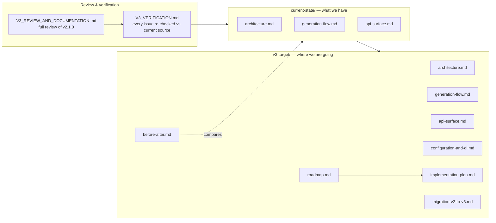

# PasswordGenerator — Documentation

This folder is the working reference for the package: the **shipped v3 design** and the historical
review of the v2.1.0 code it replaced. Diagrams are written in [Mermaid](https://mermaid.js.org/) and
render directly on GitHub.

## How the docs fit together

## Reading order

1. **`V3_REVIEW_AND_DOCUMENTATION.md`** — the original full review (API, bugs, packaging, gaps).
2. **`V3_VERIFICATION.md`** — each issue re-checked against the current `master` source, with verdicts.
3. **`current-state/`** — diagrammed snapshot of the v2.1.0 code (now **historical**; the issues it
   documents are resolved in v3 — see the root [`CHANGELOG.md`](../CHANGELOG.md)).
4. **`v3-target/`** — the v3 design (now **shipped**), diagrammed, with a before/after, a roadmap, a
   phased **`implementation-plan.md`**, and the user-facing **`migration-v2-to-v3.md`**.

## Conventions

- **Current state** describes `master` @ v2.1.0, `netstandard2.0`. Code references use
  `file:line` against that source.
- **v3 target** describes the design that shipped in v3.0.0 (`netstandard2.0;net8.0`, nullable
  enabled). The `implementation-plan.md` records where the shipped code intentionally diverged from
  the earlier proposal (e.g. the `IPasswordBuilder` split was deferred and sync methods were not
  obsoleted).
- Each "target" doc ends with a **Why this is better** note tied back to a verified issue.
