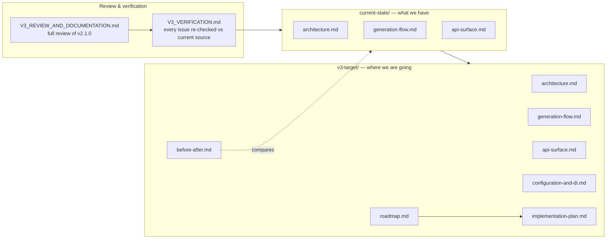

# PasswordGenerator — Documentation

This folder is the working reference for the package as it is **today** and the design we are
steering it toward in **v3**. Diagrams are written in [Mermaid](https://mermaid.js.org/) and render
directly on GitHub.

## How the docs fit together

## Reading order

1. **`V3_REVIEW_AND_DOCUMENTATION.md`** — the original full review (API, bugs, packaging, gaps).
2. **`V3_VERIFICATION.md`** — each issue re-checked against the current `master` source, with verdicts.
3. **`current-state/`** — diagrammed snapshot of the code as it runs today.
4. **`v3-target/`** — the proposed v3 design, diagrammed, with a before/after, a roadmap, and a
   phased **`implementation-plan.md`** (starts with installing the .NET SDK via bash).

## Conventions

- **Current state** describes `master` @ v2.1.0, `netstandard2.0`. Code references use
  `file:line` against that source.
- **v3 target** is a proposal for discussion, not yet implemented. Anything in `v3-target/` is
  subject to change as we agree the plan.
- Each "target" doc ends with a **Why this is better** note tied back to a verified issue.
