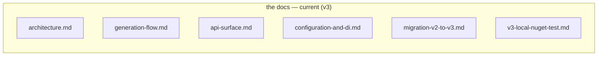

# PasswordGenerator — Documentation

This folder is the working reference for the package as it ships today (**v3**). Diagrams are written
in [Mermaid](https://mermaid.js.org/) and render directly on GitHub.

## How the docs fit together

## Reading order

Each page ends with a navigation footer, so you can read straight through from start to finish.

1. [**Architecture**](architecture.md) — type relationships, the random source, and the multi-targeting strategy.
2. [**Generation Flow**](generation-flow.md) — how `Next()`/`Generate()` build a password, plus the async path.
3. [**Public API Surface**](api-surface.md) — the public fluent surface, presets, and batch/async APIs.
4. [**Configuration & DI**](configuration-and-di.md) — `PasswordOptions`, settings resolution, and DI registration.
5. [**Migrating from v2.x to v3.0**](migration-v2-to-v3.md) — the user-facing upgrade guide from 2.x.
6. [**Local NuGet test report**](v3-local-nuget-test.md) — local `dotnet pack` / install verification procedure.

**Start reading → [Architecture](architecture.md)**

## Conventions

- These docs describe **v3.0.0** as shipped: targets `net8.0;net10.0`, nullable enabled.
- Each doc ends with a **Why this is better** note.
