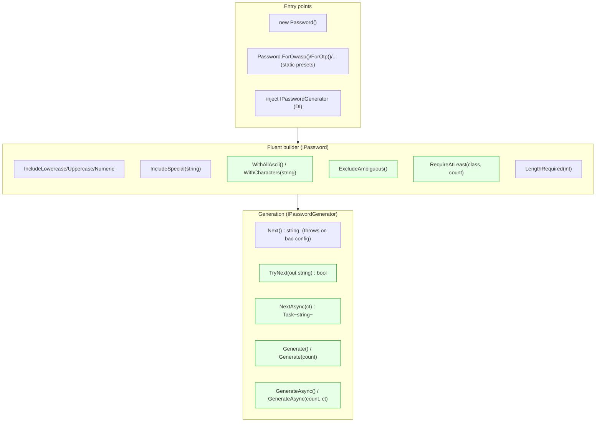
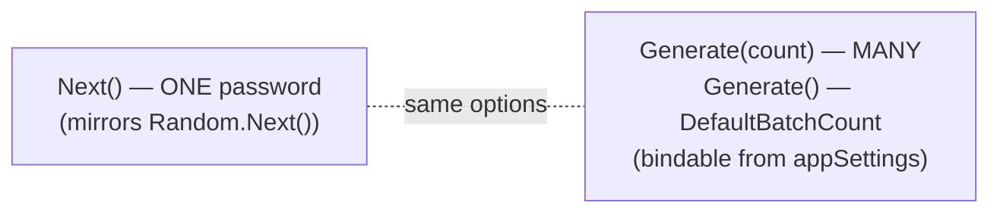
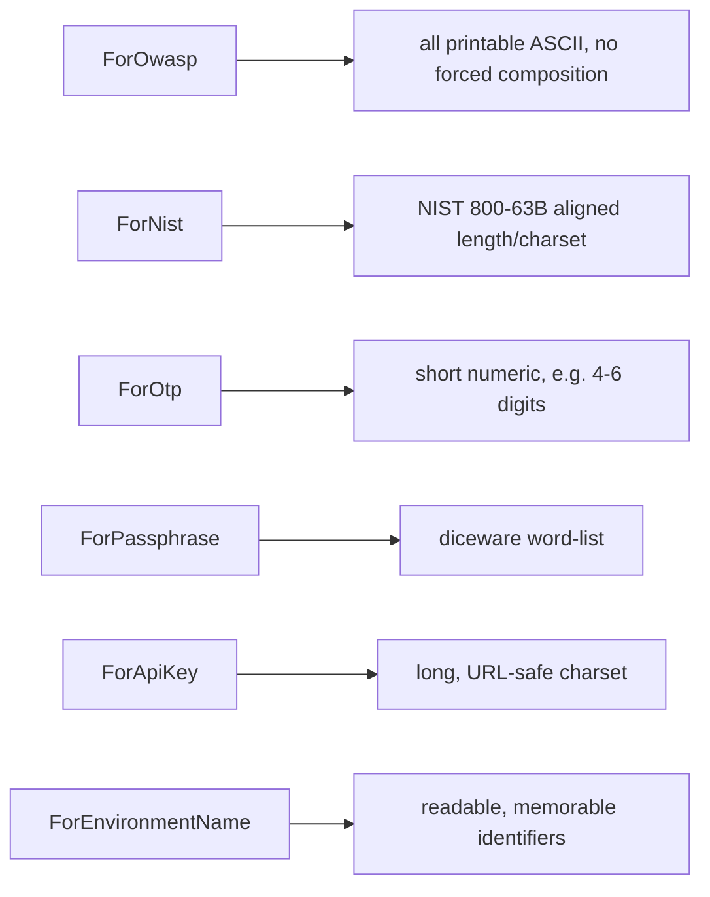
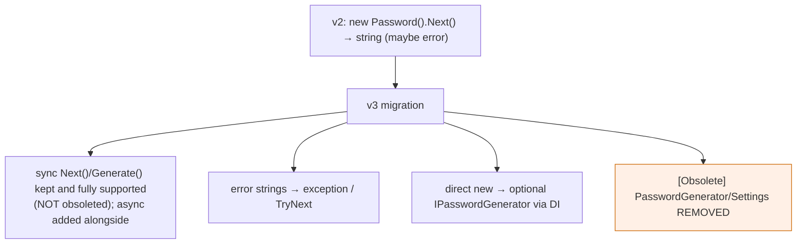

# Public API Surface

Keeps the familiar fluent feel; adds safety, presets, batch, async, and custom pools.

> The fluent builder is `IPassword` (there is no separate `IPasswordBuilder`/`Build()` split).
> `Password` implements both `IPassword` and the generation contract `IPasswordGenerator`.
> Passphrases return an `IPasswordGenerator` (`PassphraseGenerator`). See
> `archive/implementation-plan.md` for how the shipped surface diverged from the early proposal.

## API map

## Single vs batch (naming kept intentional)

`.Next()` is retained because the original API was modelled on `Random.Next()`. `.Generate()` is the
new batch-oriented entry: `Generate(count)` plus a parameterless `Generate()` that uses the
configurable `DefaultBatchCount` (bindable from appSettings). The `.Count(n)` chaining shape from the
early proposal was not added — there is no new return type.

## Presets → standards mapping

Presets are static factory methods on `Password` (sugar over the fluent builder); any subsequent
fluent call still overrides them (resolution order is documented in `configuration-and-di.md`).

## Surfacing the broader purpose

The library is **not password-only**. The same surface generates OTPs, environment names, API keys,
and other identifiers — so the library deliberately keeps the per-class `Include*` methods and adds
`WithCharacters`/`WithAllAscii` rather than forcing OWASP composition or a global 12-char minimum.

## Deprecation / migration shape

> Sync methods are **not** marked `[Obsolete]`: generation is CPU-bound, so obsoleting sync in favour
> of async would be an anti-pattern and would spam every consumer with build warnings. Async exists
> for ergonomics and cancellation only.

**Why this is better:** every gap noted in the v2.1.0 review (`archive/current-state/api-surface.md`) is closed
(`TryNext`/async/DI/presets/appSettings/custom pools), failures become explicit, and existing single
`.Next()` users still work unchanged, giving a gentle upgrade path.
