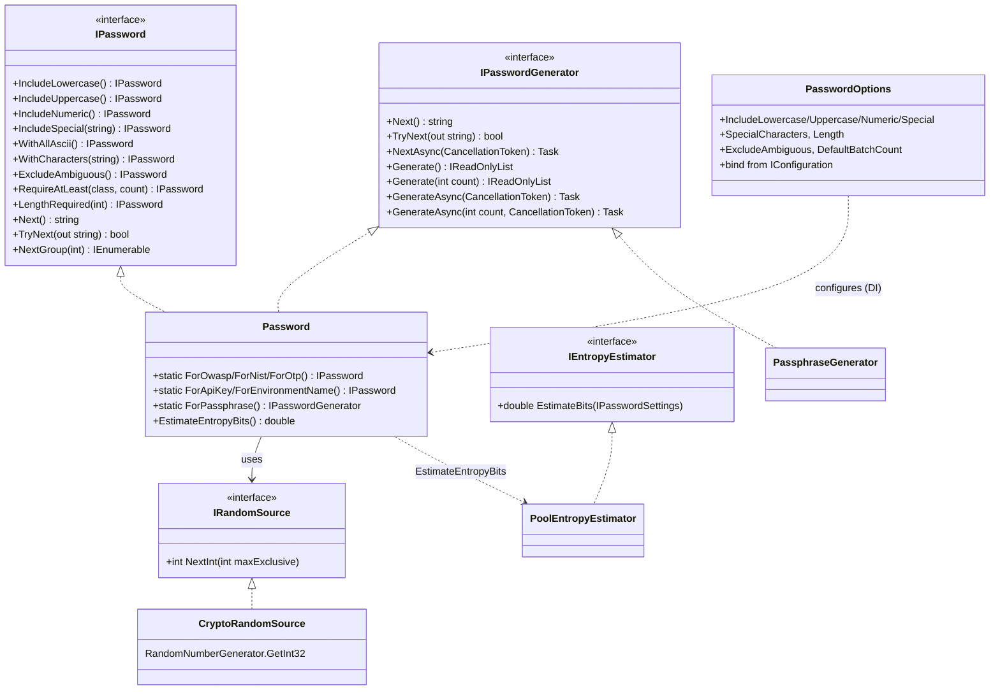
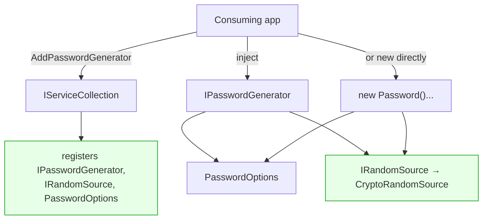
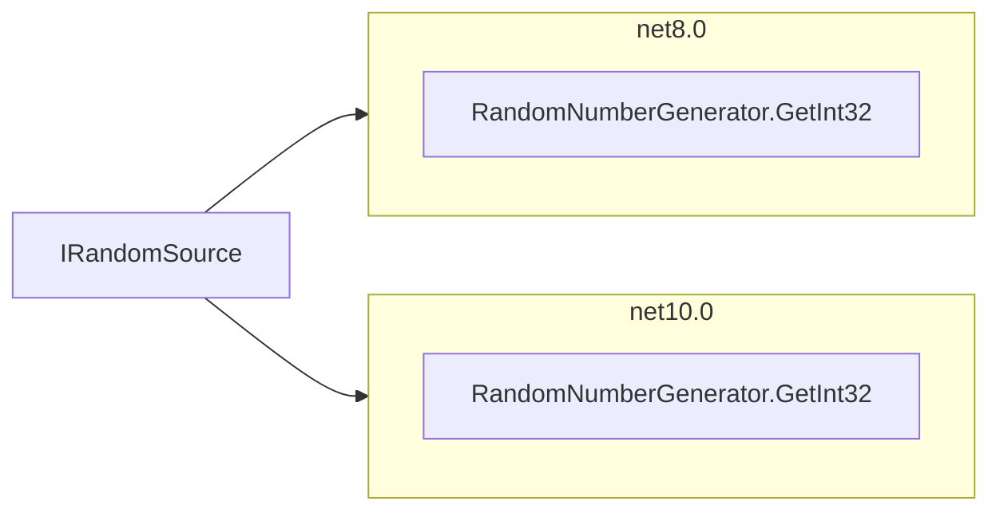

# Architecture

> Multi-targets `net8.0;net10.0`, nullable enabled. `IPassword` is the fluent builder (no
> separate `IPasswordBuilder`/`Build()`); `Password` implements both `IPassword` and the generation
> contract `IPasswordGenerator`.

## Type relationships

Key points:
- **`IRandomSource` abstraction** wraps the CSPRNG (unbiased `RandomNumberGenerator.GetInt32`). No
  `static`, injectable — a deterministic `IRandomSource` can be injected in unit tests — and the
  Guid-based `Shuffle` is gone in favour of Fisher–Yates.
- **`PasswordOptions`** is the DI config object, bindable from `IConfiguration`.
- **Presets** are static factory methods on `Password` that pre-fill the fluent builder.
- The `[Obsolete]` v2 wrappers from earlier proposals are not present.

## Target composition (with DI)

The fluent API behaves **identically** whether the instance is `new`'d or resolved from DI — the DI
registration is only responsible for wiring `IRandomSource` and default `PasswordOptions`.

## Multi-targeting strategy

Both targets use the same built-in `RandomNumberGenerator.GetInt32`, so `CryptoRandomSource` needs no
`#if` and exposes one uniform public surface. (`netstandard2.0`, which required a manual
rejection-sampling fallback, was dropped in v3 — see the [changelog](../CHANGELOG.md).)

**Why this is better:** removes the `static`/undisposed RNG, makes randomness unbiased and testable
(inject a deterministic `IRandomSource` in unit tests), and uses the fast, allocation-free built-in
crypto API on every supported runtime.
