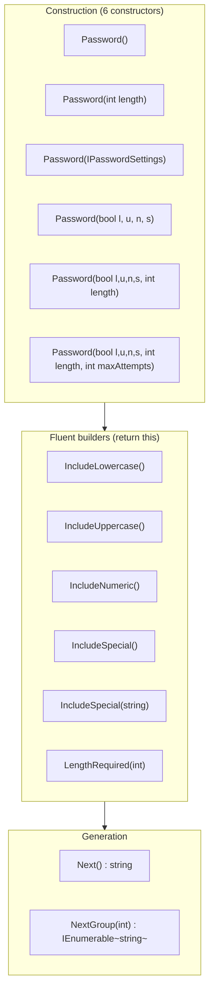
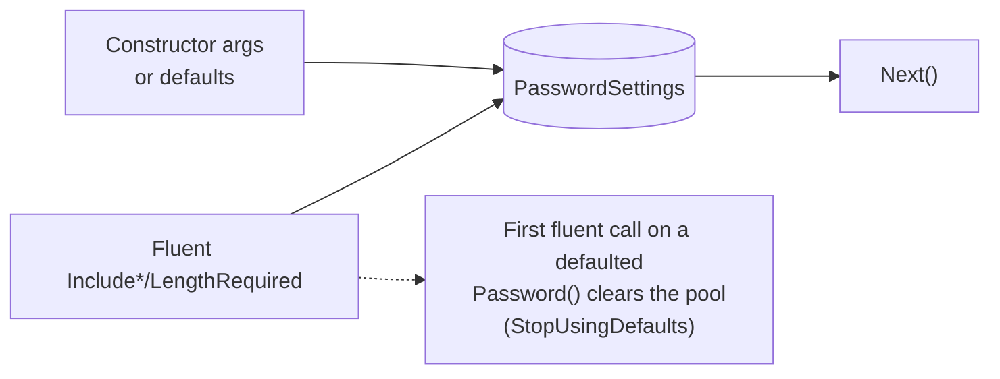
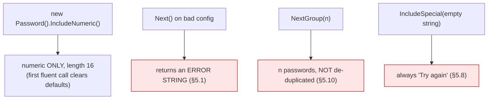

# Current State — Public API Surface (v2.1.0)

> **Historical.** This describes v2.1.0. The issues noted here are resolved in v3 — see the root
> [`CHANGELOG.md`](../../../CHANGELOG.md) and the [migration guide](../../migration-v2-to-v3.md).

What a caller can do today, and how configuration is resolved.

## API map

## Configuration resolution (today)

There are only two sources: constructor arguments (or built-in defaults) and fluent calls. There is
**no** external configuration (`appSettings`), **no** DI, and **no** presets.

Defaults: all four classes on, length 16, `MaximumAttempts` 10000, length bounds 4–256, default
special set `!#$%&*@\` (8 chars).

## Key behaviour quirks (verified)

## What the surface does NOT offer (verified gaps, §8)

| Missing today | Confirmed |
|---|---|
| `TryNext` / result type (failures are strings) | ✅ |
| Async API | ✅ |
| DI registration helper | ✅ |
| Presets (OWASP/NIST/OTP/passphrase/API-key/env-name) | ✅ |
| `appSettings` configuration | ✅ |
| First-class custom alphabet (`WithAllAscii`/`WithCharacters`) | ✅ (only hackable via `IncludeSpecial(string)`) |
| Exclude-ambiguous, per-class minimums, entropy estimate | ✅ |
| `netstandard2.0` + `net8.0` multi-target / nullable | ✅ (netstandard2.0 only) |

These gaps define the v3 surface in `../../api-surface.md`.
