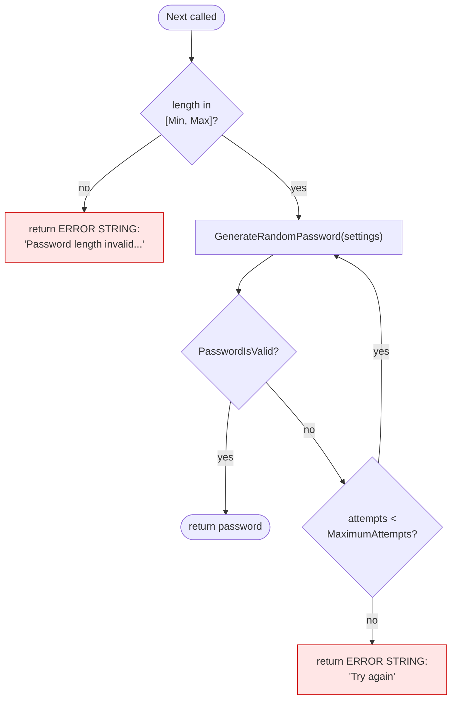
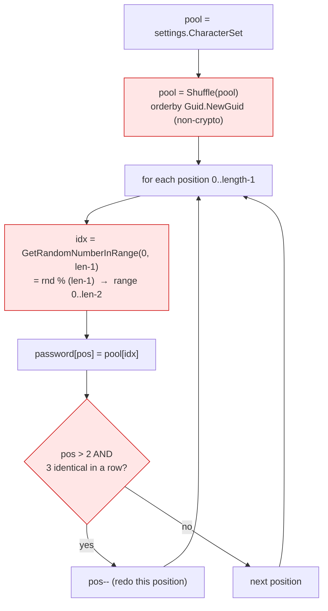
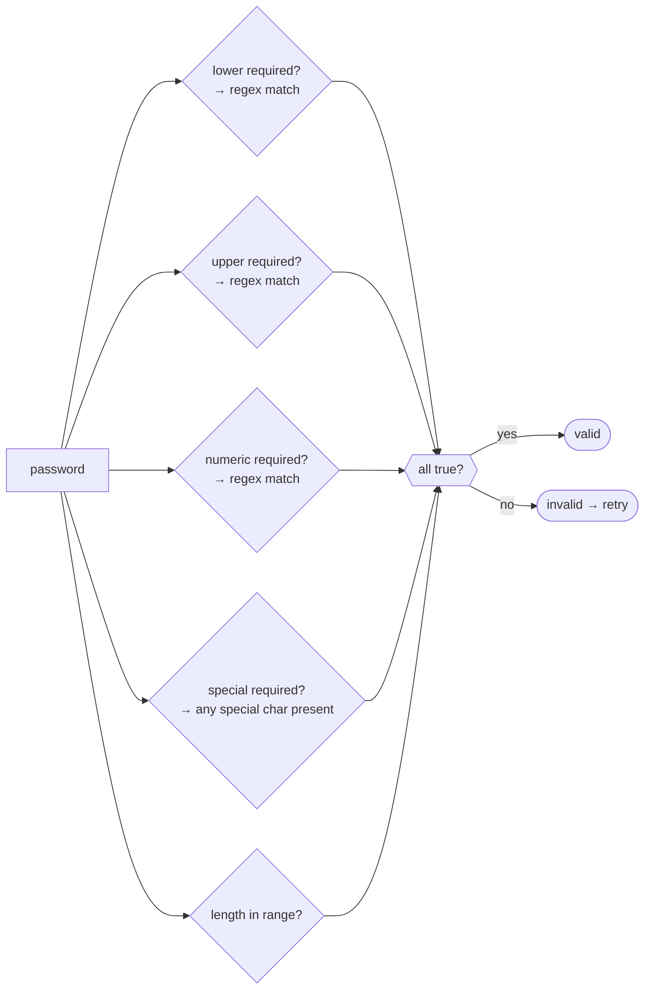
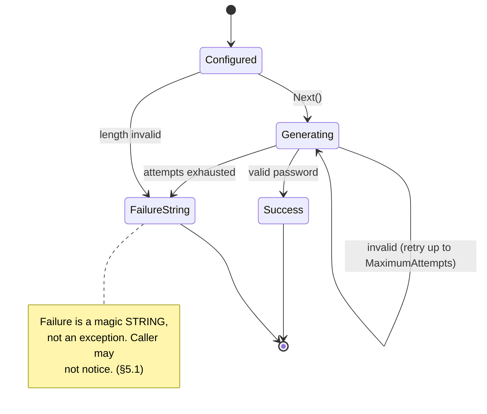

# Current State — Generation Flow (v2.1.0)

> **Historical.** This describes v2.1.0. The issues noted here are resolved in v3 — see the root
> [`CHANGELOG.md`](../../../CHANGELOG.md) and the [migration guide](../../migration-v2-to-v3.md).

How `Next()` produces a password today (`Password.cs:114-193`).

## `Next()` control flow

**Verified problem (§5.1):** the two red nodes return human-readable **error strings in the same
`string` return slot as a real password**. A caller that does not special-case them will store an
error message as the user's password. There is no exception and no `TryNext`/result type.

## Inside `GenerateRandomPassword`

Verified problems in this loop:
- **§5.5** — `Shuffle` is a non-crypto `Guid.NewGuid()` sort (redundant; randomness really comes from
  `GetRandomNumberInRange`).
- **§5.2 (off-by-one)** — `GetRandomNumberInRange(0, len-1)` computes `% (len-1)`, so the **top index
  is never selected**; the effective alphabet is one char short per password.
- **§5.3 (modulo bias)** — `rnd % n` over a full-range `Int32` is not uniform.
- **§5.4** — the "no 3 identical in a row" guard only starts at position > 2, so the **first three
  characters can be identical**.

## How validity is decided (`PasswordIsValid`, `Password.cs:208`)

**Verified problem (§5.8):** if `IncludeSpecial` is true but the custom special set is empty/whitespace,
`specialIsValid` stays `false` forever, so every attempt fails and `Next()` silently returns
`"Try again"`.

## Why this design is fragile

The whole correctness contract hinges on probabilistic retry + string sentinels — the core thing v3
replaces (see `../../generation-flow.md`).
