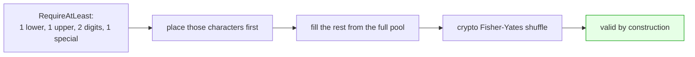
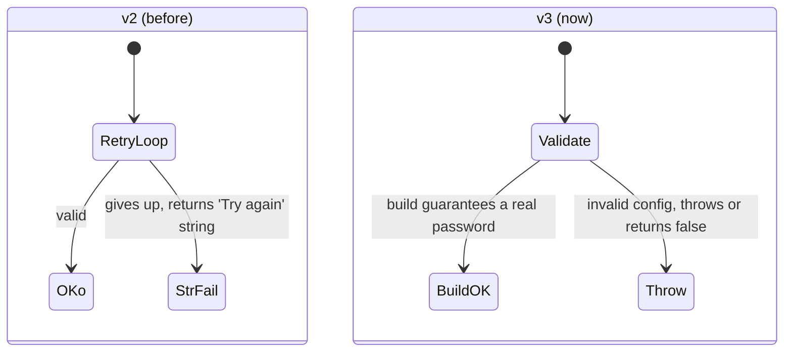

# PasswordGenerator v3 is here, and it's a proper rewrite

If you've used my PasswordGenerator package over the years, thank you. It's been
downloaded millions of times on NuGet, which still amazes me. It started as a
small helper to create random passwords in .NET, and the community kept it going
with bug reports, pull requests and ideas.

Version 3 is the biggest update it has ever had. I've rewritten the core, fixed
some long-standing correctness issues, and added a load of features I've wanted
for a while. Here's the tour.

## Why a rewrite?

The honest answer is that the old code had a few problems hiding under the
surface. The randomness wasn't as fair as it should have been, there was an
off-by-one in the length handling, and the shuffle relied on a GUID, which was
never really fit for the job.

None of these made the package unusable, but for something whose entire purpose
is generating secure passwords, "good enough" isn't good enough. So I took the
chance to put it right.

## The security and correctness fixes

This is the part I care about most.

1. **Properly secure, unbiased randomness.** v3 uses a cryptographically secure
   random source and samples integers with `RandomNumberGenerator.GetInt32`,
   which removes the modulo bias that crept into the old approach. Every
   character now has a fair chance of being picked.
2. **Fixed the off-by-one in length handling**, so you get exactly the length you
   asked for.
3. **Swapped the GUID-based shuffle for a Fisher-Yates shuffle**, which is the
   right tool for shuffling a set of characters evenly.
4. **Tidied up the RNG lifecycle.** The random source is now owned and disposed
   properly, and the old static RNG and dead code are gone.
5. **Empty special-character sets are now validated** instead of quietly giving
   you a weaker password.

```csharp
// Same friendly API, much stronger guarantees underneath.
var password = new Password(20).Next();
```

Here's how a password is built in v3. If you ask for, say, at least two digits,
those get placed first, the rest of the length is filled from your chosen pool,
and then the whole thing gets a proper crypto shuffle. So your requirements are
guaranteed by construction, with no "generate and hope" retry loop.



## New features worth knowing about

There's quite a lot here, so I'll pick out the highlights.

### Async and batch APIs

You can now await your passwords and generate them in batches.

```csharp
string one = await pwd.NextAsync(cancellationToken);
IReadOnlyList<string> ten = pwd.Generate(10);
IReadOnlyList<string> ten2 = await pwd.GenerateAsync(10, cancellationToken);
```

### Dependency injection

If you're building an ASP.NET Core app, you can register the generator once and
inject `IPasswordGenerator` wherever you need it. You can configure it in code or
bind it from your `appSettings.json`.

```csharp
services.AddPasswordGenerator(o =>
{
    o.Length = 20;
    o.IncludeSpecial = true;
    o.ExcludeAmbiguous = true;
});
```

### Ready-made presets

Sometimes you just want a sensible default for a common job. The new presets give
you exactly that.

```csharp
string strong  = Password.ForOwasp().Next();             // full printable-ASCII pool, length 16
string nist    = Password.ForNist().Next();              // NIST-aligned, length 12
string otp     = Password.ForOtp(6).Next();              // 6-digit one-time code
string apiKey  = Password.ForApiKey(32).Next();          // URL-safe token
string envName = Password.ForEnvironmentName(12).Next();  // readable id, no look-alikes
```

### Much better passphrases

This is my favourite addition. v3 generates passphrases from the EFF Large
Wordlist, which is 7,776 words and gives you roughly 12.9 bits of entropy per
word. A six-word phrase is now around 77 bits, which is genuinely strong and
still easy to remember.

```csharp
string phrase    = Password.ForPassphrase(4).Next();            // e.g. "maple-river-quartz-bloom-42"
string byTarget  = Password.ForPassphraseWithEntropy(80).Next(); // word count derived to clear 80 bits
string memorable = Password.ForMemorable().Next();              // capitalised, ~80+ bits
```

If you've ever fought with a site that demands a number and a symbol, this one's
for you. Pass `includeSymbol: true` and a random symbol gets attached to one of
the words, so your phrase passes the composition rules while staying readable.

```csharp
string phrase = Password.ForPassphrase(4, includeSymbol: true).Next();
// e.g. "maple-river#-quartz-bloom-42"
```

The wordlist is by the Electronic Frontier Foundation and used under a Creative
Commons licence. Full credit to them, and you'll find the details in the
THIRD-PARTY-NOTICES file in the repo.

### Quality controls and entropy estimation

You can now strip out look-alike characters, require a minimum number from a
character class, use your own custom pool, and even ask the package how strong a
password is in bits.

```csharp
var readable = new Password(20).ExcludeAmbiguous().Next();          // no I l 1 O 0 o
var pwd      = new Password(16).RequireAtLeast(CharacterClass.Numeric, 2).Next();
var custom   = new Password().WithCharacters("ABCDEF0123456789").LengthRequired(24).Next();
double bits  = new Password(20).EstimateEntropyBits();
```

## The one breaking change to watch for

When the settings can't produce a valid password, `Next()` now throws an
`ArgumentException` rather than returning an error message dressed up as your
password. That old behaviour caught a few people out, so this is a deliberate
fix. If you'd rather not deal with exceptions, there's a non-throwing path.

```csharp
if (new Password(16).TryNext(out var result))
    Console.WriteLine(result);
```

The difference is easier to see than to describe. In v2, a configuration that
couldn't produce a password eventually handed you the string "Try again" as if it
were a real password. In v3, you either get a real password or a clear signal that
something's wrong.



## What you need to run it

v3 targets `net8.0` and `net10.0`, so you'll need .NET 8 or later. If you're
still on .NET Framework or an older runtime, the 2.x line targets
`netstandard2.0` and keeps working, so you're not stuck.

The good news is that the familiar v2 API is unchanged. Your existing `Next()`,
`NextGroup()`, constructors and `IncludeX()` calls all still work, aside from
that error-handling change above.

## Upgrading

If you're coming from v2, have a quick read of the v2 to v3 migration guide in
the repo before you upgrade. It walks through the small number of things to check
and maps the presets to the OWASP and NIST guidance behind them.

```
Install-Package PasswordGenerator
```

## A thank you

None of this happens without the community. The bug reports, the pull requests
and the conversations over the years shaped where v3 ended up, so thank you to
everyone who chipped in.

Give v3 a go, and if you spot something or have an idea, open an issue on the
[GitHub repo](https://github.com/prjseal/PasswordGenerator). I'd love to hear how
you're using it.
