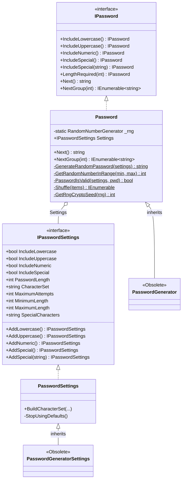
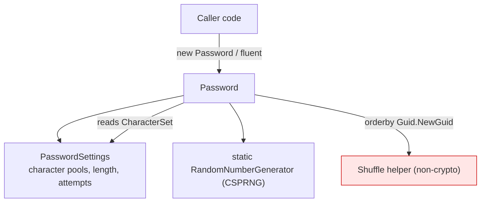

# Current State — Architecture (v2.1.0)

> **Historical.** This describes v2.1.0. The issues noted here are resolved in v3 — see the root
> [`CHANGELOG.md`](../../CHANGELOG.md) and the [migration guide](../v3-target/migration-v2-to-v3.md).

`master` @ v2.1.0 · target `netstandard2.0` · no third-party runtime dependencies.

## Type relationships

Notes:
- `PasswordGenerator` / `PasswordGeneratorSettings` are `[Obsolete]` back-compat wrappers. The five
  `CS0108` build warnings come from `PasswordGenerator` hiding `Password` methods without `new`.
- `_rng` is a **`static`** field on `Password` (`Password.cs:20`), reassigned in **every** constructor
  and never disposed (verified issue §5.6).
- `GetRngCryptoSeed` (`Password.cs:195`) is dead code still referencing the legacy
  `RNGCryptoServiceProvider` (verified issue §5.7).

## Runtime composition

The output's randomness comes from the CSPRNG via `GetRandomNumberInRange` (`Password.cs:189`). The
`Shuffle` helper (`Password.cs:247-249`) reshuffles the pool first using `Guid.NewGuid()` — a
non-crypto, non-uniform sort that is now **redundant** (verified issue §5.5, reclassified as cleanup).

## Packaging / build snapshot

- Single packable project `PasswordGenerator.csproj`, version `2.1.0`.
- Stale `PasswordGenerator.nuspec` declares `2.0.5` (verified issue §7).
- `dotnet pack` emits `NU5048` (deprecated `PackageIconUrl`) and "missing readme".
- Tests target EOL `netcoreapp2.2` (pulls vulnerable `Microsoft.NETCore.App 2.2.0`).
