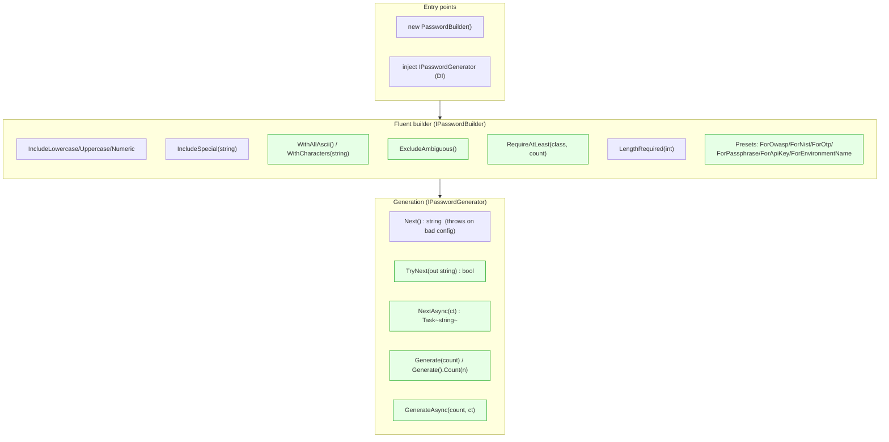
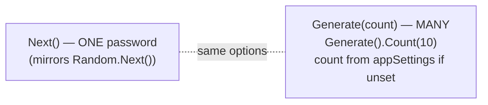
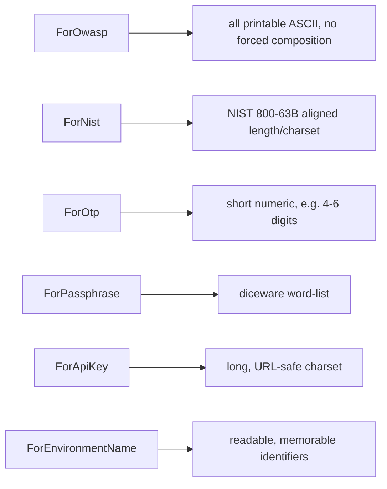
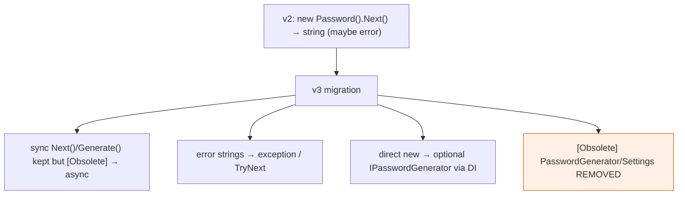

# v3 Target — Public API Surface (proposal)

Keeps the familiar fluent feel; adds safety, presets, batch, async, and custom pools.

## Target API map

## Single vs batch (naming kept intentional)

`.Next()` is retained because the original API was modelled on `Random.Next()`. `.Generate()` is the
new batch-oriented entry with count overloads, `.Count(n)` chaining, and an `appSettings` default.

## Presets → standards mapping

Presets are sugar over `PasswordOptions`; any subsequent fluent call still overrides them
(resolution order is documented in `configuration-and-di.md`).

## Surfacing the broader purpose

The library is **not password-only**. The same surface generates OTPs, environment names, API keys,
and other identifiers — so v3 deliberately keeps the per-class `Include*` methods and adds
`WithCharacters`/`WithAllAscii` rather than forcing OWASP composition or a global 12-char minimum.

## Deprecation / migration shape

**Why this is better:** every verified gap in `../current-state/api-surface.md` is closed
(`TryNext`/async/DI/presets/appSettings/custom pools), failures become explicit, and existing single
`.Next()` users still work (with an obsolete-hint nudge), giving a gentle upgrade path.
