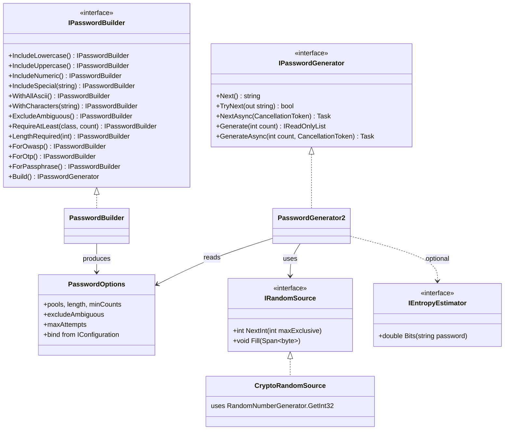
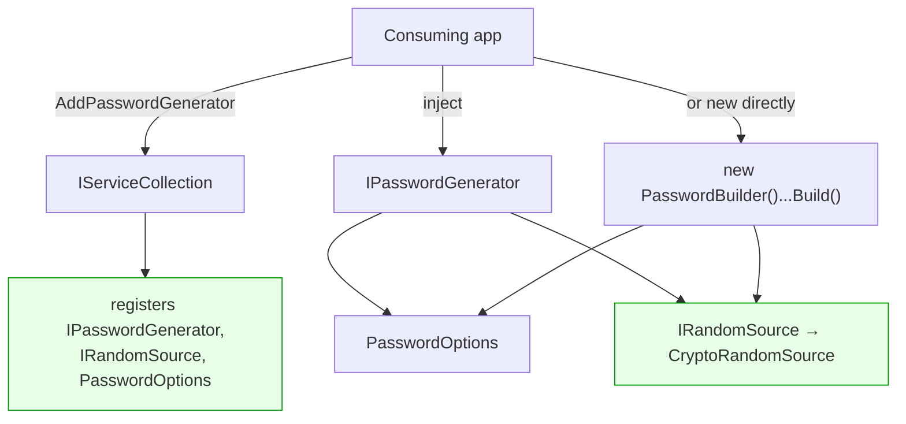
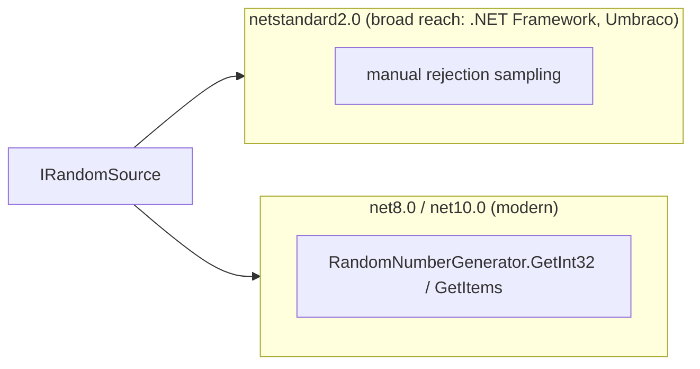

# v3 Target — Architecture (proposal)

> Proposed design for discussion. Multi-target `netstandard2.0;net8.0` (optionally `net10.0`),
> nullable enabled. Aligns with the adjusted plan in `../V3_VERIFICATION.md` §3.

## Target type relationships

Key shifts from today:
- **`IRandomSource` abstraction** wraps the CSPRNG (unbiased `RandomNumberGenerator.GetInt32` on
  `net8.0`; rejection-sampling fallback on `netstandard2.0`). No `static`, disposable-aware,
  injectable. Fixes verified §5.2/§5.3/§5.6 and lets the Guid `Shuffle` be deleted (§5.5).
- **`PasswordOptions`** is the single config object, bindable from `IConfiguration`.
- **Presets** are builder methods that pre-fill `PasswordOptions`.
- The `[Obsolete]` v2 wrappers are **removed** in v3 (recommended in `../V3_VERIFICATION.md` §4).

## Target composition (with DI)

The fluent API behaves **identically** whether the instance is `new`'d or resolved from DI — the DI
registration is only responsible for wiring `IRandomSource` and default `PasswordOptions`.

## Multi-targeting strategy

`#if` inside `CryptoRandomSource` selects the optimal API per target while keeping one public surface.

**Why this is better:** removes the `static`/undisposed RNG, makes randomness unbiased and testable
(inject a deterministic `IRandomSource` in unit tests), keeps .NET Framework users supported, and
gives modern consumers the fast built-in APIs — addressing verified issues §5.2, §5.3, §5.5, §5.6 and
gaps §8 (async/DI/multi-target) at the architecture level.
