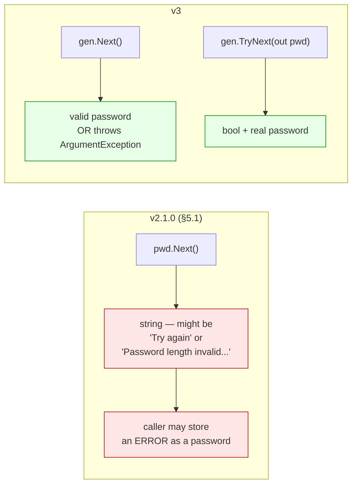
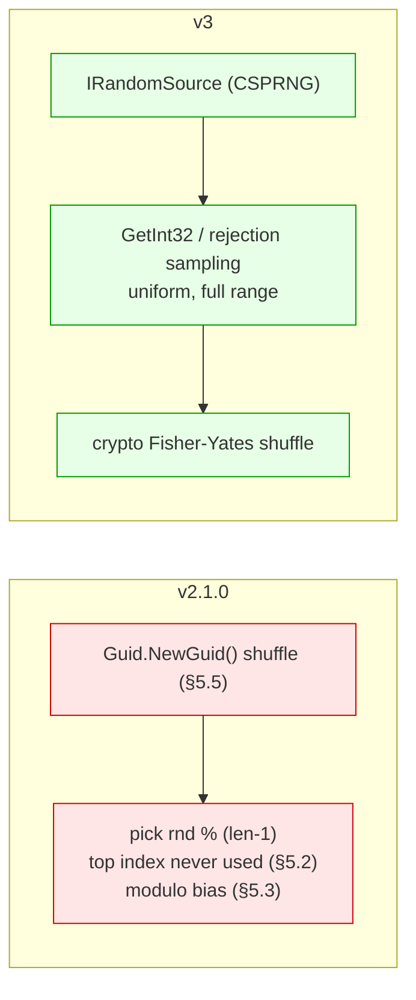
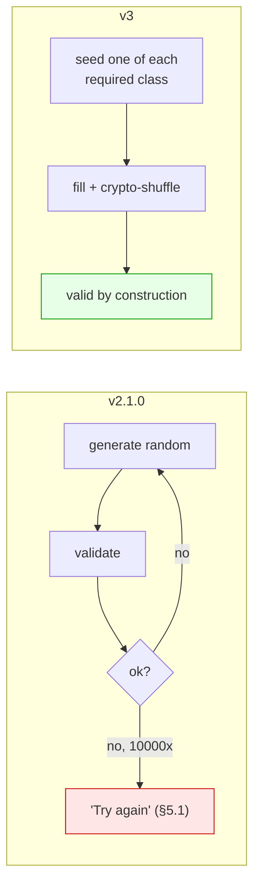
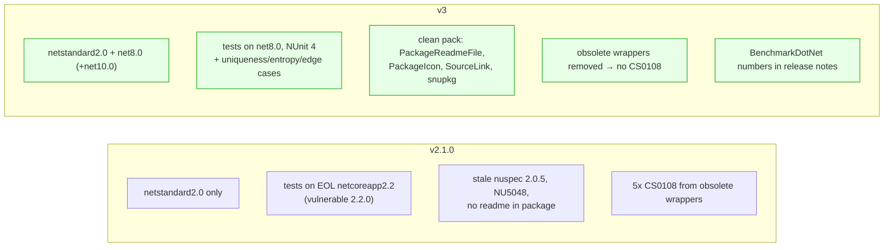
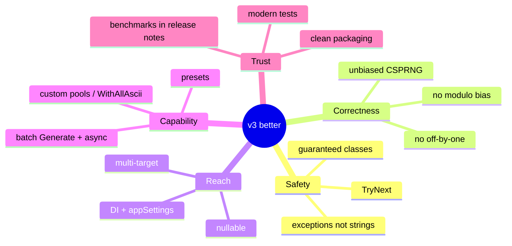

# v3 Target — Before / After (proposal)

Side-by-side of the things that change most, each tied to a verified issue.

## 1. Failure handling



```csharp
// Before — silent footgun
var pwd = new Password(3).Next();          // = "Password length invalid. Must be between 4 and 256..."

// After — explicit
try { var pwd = gen.Next(); }              // throws ArgumentException for length 3
catch (ArgumentException ex) { /* handle */ }
if (gen.TryNext(out var p)) { /* use p */ }
```

## 2. Randomness & character selection



## 3. Guaranteeing required character classes



## 4. Configuration & wiring

| Concern | v2.1.0 | v3 |
|---|---|---|
| Sources | constructor args + fluent only | fluent **>** appSettings **>** default |
| DI | none | opt-in `AddPasswordGenerator(...)` (+ `IConfiguration` overload) |
| RNG ownership | `static`, reassigned per ctor, never disposed (§5.6) | injected `IRandomSource`, disposable-aware |
| Presets | none | `ForOwasp/ForNist/ForOtp/ForPassphrase/ForApiKey/ForEnvironmentName` |

## 5. Targets, tests, packaging



## Net effect


