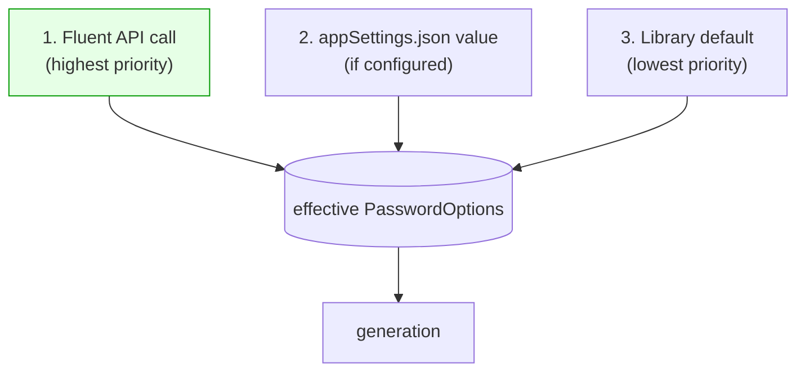
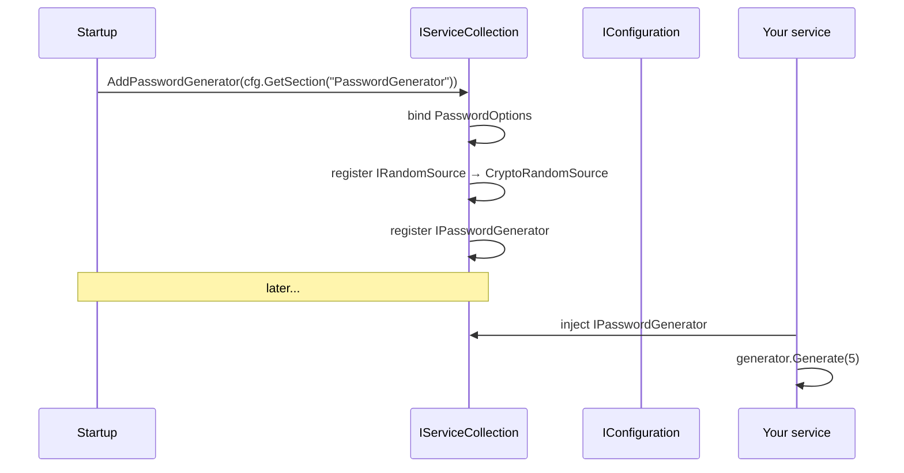
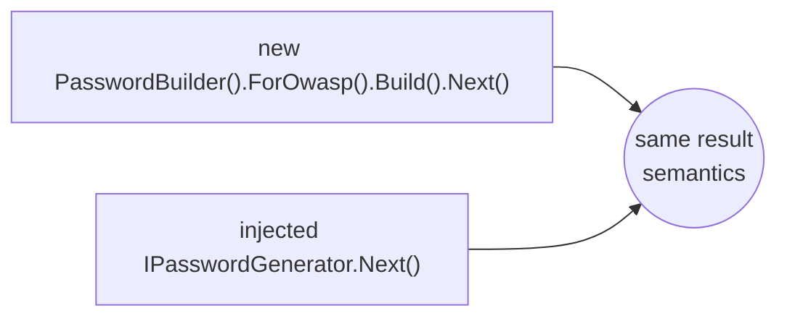

# v3 Target — Configuration & Dependency Injection (proposal)

## Settings resolution order



A fluent call always wins; otherwise `appSettings` is used if present; otherwise the library default
applies. `appSettings` binding is an **opt-in, separate step** — it is never auto-applied.

## Example `appSettings.json`

```jsonc
{
  "PasswordGenerator": {
    "Length": 20,
    "IncludeLowercase": true,
    "IncludeUppercase": true,
    "IncludeNumeric": true,
    "Special": "!#$%&*@",
    "ExcludeAmbiguous": true,
    "DefaultBatchCount": 5
  }
}
```

## DI registration (opt-in, not auto-registered on install)



Two overloads (answering open question #3 in `../V3_VERIFICATION.md`):

```csharp
services.AddPasswordGenerator(options => { options.Length = 20; });        // code
services.AddPasswordGenerator(config.GetSection("PasswordGenerator"));      // one-line appSettings bind
```

**Why opt-in, not auto-register:** auto-registering on package install is inflexible and risks
service-collection conflicts. Requiring an explicit `AddPasswordGenerator(...)` call keeps the
consumer in control and lets the registration wire up `IRandomSource` so callers never touch the RNG.

## Identical behaviour: `new` vs DI



The fluent API must produce identical results whether the instance is constructed directly or
resolved from the container; DI only changes *how the dependencies are supplied*, not *what the
builder does*.

**Why this is better:** teams can centralise password policy in `appSettings` (closing verified gap
§8) without forcing it on every call site, the RNG dependency is wired once, and unit tests can swap
`IRandomSource` for a deterministic stub.
