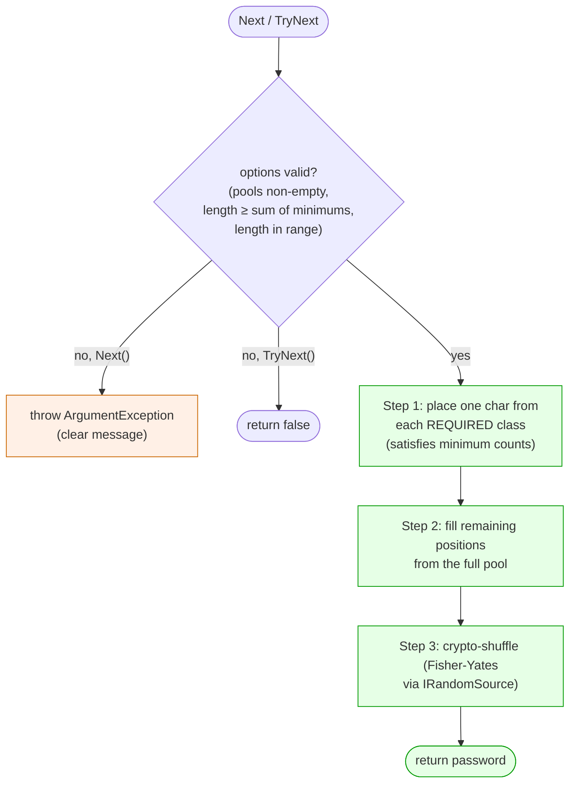
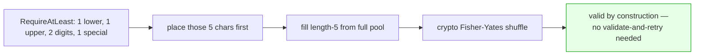
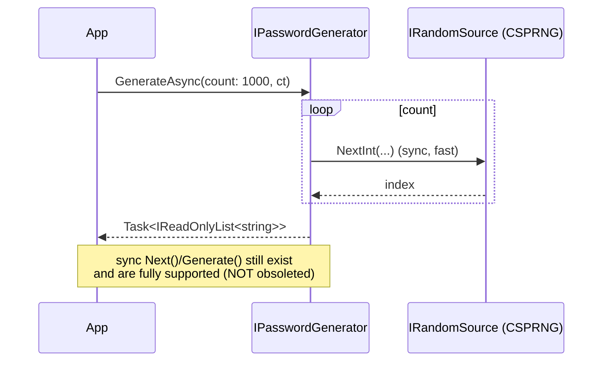
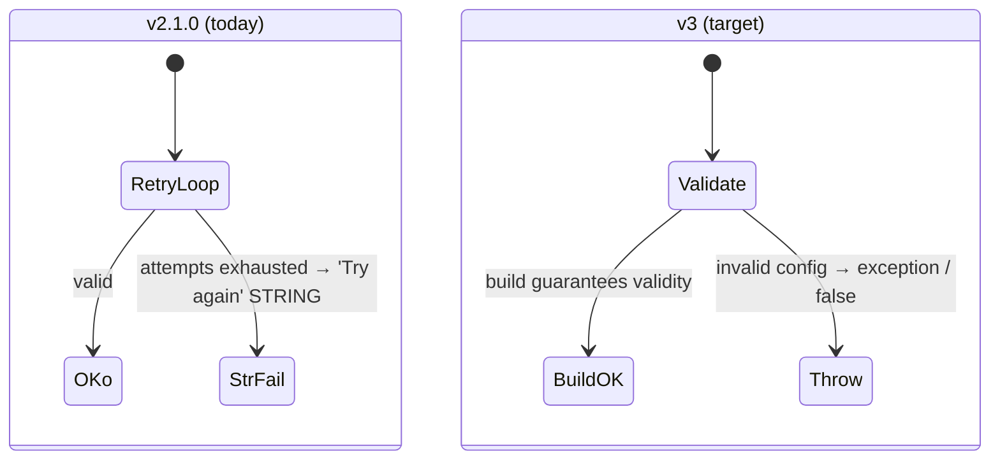

# v3 Target — Generation Flow

Replaces probabilistic retry + string sentinels with **deterministic construction + exceptions**.

## Target `Next()` / `TryNext()` flow

**What changed vs today (`../current-state/generation-flow.md`):**
- No retry loop, no `MaximumAttempts` gamble, **no `"Try again"` string**. Required classes are
  *guaranteed* by construction (fixes the probabilistic guarantee gap, §8).
- Invalid configuration **throws** (`Next()`) or returns `false` (`TryNext`) — never a fake password
  (fixes §5.1 and §5.8).
- Selection uses unbiased `IRandomSource.NextInt(maxExclusive)` — no `% (len-1)` off-by-one, no
  modulo bias (fixes §5.2, §5.3).
- Shuffle is a real crypto Fisher–Yates, replacing `orderby Guid.NewGuid()` (fixes/cleans §5.5).

## Deterministic class-seeding (the core idea)

## Async path (`NextAsync` / `GenerateAsync`)

> Note: generation is CPU-bound, so async mainly helps large-batch ergonomics and cancellation, not
> raw throughput — the **BenchmarkDotNet** suite (plan §10/§12) exists to prove where async actually
> pays off, with numbers published in every release note.

## Failure contract — before vs after

**Why this is better:** failure is impossible to ignore (exception or `bool`), output is always a
real password, randomness is unbiased and fully covered by deterministic-RNG unit tests, and the
slowest part of the old design (validate-and-retry) is gone.
