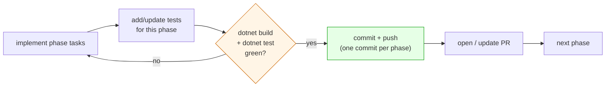
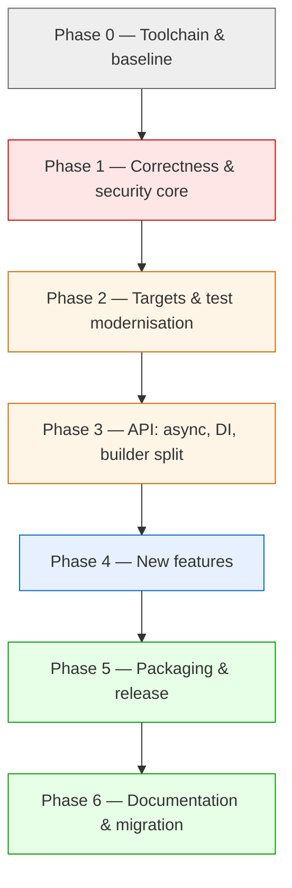

# v3 Target — Implementation Plan (phased)

> Actionable, phase-by-phase plan to deliver the v3 design in `architecture.md`,
> `generation-flow.md`, `api-surface.md`, `configuration-and-di.md` and `before-after.md`.
> Sequencing follows `roadmap.md`; issue numbers (§5.x / §8) reference `../V3_VERIFICATION.md`.

## Working principles

- **One phase = one PR** (or a small stack), each independently green and reviewable.
- **Commit and push at the end of every phase** — no phase spans an uncommitted working tree. Each
  phase ends with its own commit (suggested messages below) pushed to the working branch.
- **Tests must pass before each phase's commit.** A phase is not "done" until the appropriate test
  suite is green (`dotnet test` exits 0). Never commit a phase with failing or skipped-for-
  convenience tests.
- **Keep `master` shippable.** Behaviour-breaking changes (exceptions, removed wrappers) land behind
  the v3 major and are called out in the migration guide.
- **Test-first for correctness work** — write the failing test that encodes the bug, then fix it.
- **Verify every phase with the SDK** (see Phase 0) before committing.

## Definition of done — applies to EVERY phase

Each phase repeats the same loop and only advances once it closes:



A phase's checklist is complete only when **all** of the following hold:
1. The phase's tasks are implemented.
2. Tests covering the phase's changes exist and **pass** (`dotnet test` returns 0).
3. The build is green at the warning level the phase targets (e.g. Phase 3 must show zero `CS0108`).
4. The work is **committed and pushed** as that phase's commit.

## Phase map



---

## Phase 0 — Toolchain & baseline

**Objective:** a reproducible build/test environment and a known-green starting point. The remote /
CI containers do **not** ship the .NET SDK, so installing it is the first task of any work session.

**Tasks**
1. **Install dotnet via bash** (verified working in this environment):
   ```bash
   cd /tmp
   curl -fsSL https://dot.net/v1/dotnet-install.sh -o dotnet-install.sh
   chmod +x dotnet-install.sh
   ./dotnet-install.sh --channel 8.0 --install-dir /tmp/dotnet
   export PATH="/tmp/dotnet:$PATH"
   export DOTNET_CLI_TELEMETRY_OPTOUT=1
   dotnet --version    # expect 8.0.4xx
   ```
   (Add `--channel 10.0` as a second install once we multi-target to `net10.0`.)
2. Establish the baseline:
   ```bash
   dotnet build PasswordGenerator/PasswordGenerator.csproj -c Release    # expect 5x CS0108 warnings
   dotnet build PasswordGenerator.Tests/PasswordGenerator.Tests.csproj -c Release
   ```
   Tests currently target EOL `netcoreapp2.2` and cannot run on a modern-only runtime; record this as
   the reason Phase 2 retargets them. (Baseline behaviour: 24 tests, all passing when run on net8.)
3. Confirm CI is on the dotnet CLI (already done: `appveyor.yml` uses `dotnet restore/build/test/pack`,
   `deploy: off`).

**Verification / exit criteria**
- `dotnet --version` prints an 8.0.x SDK.
- Library builds (warnings only); CI build is green.
- **Tests:** the existing suite (24 tests) runs and **passes** (run on net8 in this environment, since
  the `netcoreapp2.2` runtime is EOL) — this is the green baseline every later phase is measured against.
- A `docs/`-referenced note records the baseline warning set so later phases can show them clearing.
- **Commit & push** this phase, e.g. `chore: establish v3 toolchain and green baseline`.

**Closes:** nothing yet (setup).

---

## Phase 1 — Correctness & security core (Tier 1)

**Objective:** make generation correct, unbiased, and fail-loud — without changing target frameworks
yet (stay on `netstandard2.0`, use manual rejection sampling; the optimised `net8` path arrives in
Phase 2).

**Tasks**
1. **Introduce `IRandomSource` + `CryptoRandomSource`** wrapping `RandomNumberGenerator`. Provide
   `int NextInt(int maxExclusive)` using **rejection sampling** (uniform, no modulo bias, no
   off-by-one). Remove the `static` RNG field. *(closes §5.2, §5.3, §5.6)*
2. **Delete the Guid `Shuffle`**; replace pool randomisation with a crypto Fisher–Yates using
   `IRandomSource`. *(closes §5.5 cleanup)*
3. **Delete dead `GetRngCryptoSeed`** and the `RNGCryptoServiceProvider` reference. *(closes §5.7)*
4. **Deterministic class-seeding:** place one char per required class first, fill the rest, then
   shuffle — so output is valid by construction. Remove the validate-and-retry loop and
   `MaximumAttempts` gamble. *(closes the probabilistic-guarantee gap)*
5. **Fail-loud contract:** invalid configuration throws `ArgumentException`; add
   `bool TryNext(out string)`. No method ever returns `"Try again"` / a length-error string.
   *(closes §5.1)*
6. **Up-front config validation** including the empty/whitespace custom-special-set case.
   *(closes §5.8)*
7. **Fix the consecutive-char rule** (or drop it deliberately) so it can't allow 3 identical leading
   chars. *(closes §5.4)*

**Files:** `Password.cs`, `PasswordSettings.cs`, new `IRandomSource.cs` / `CryptoRandomSource.cs`,
plus tests.

**Verification / exit criteria**
- New unit tests with a **deterministic `IRandomSource` stub** prove uniform selection, the seeding
  guarantee, and exception/`TryNext` behaviour.
- **Tests green:** `dotnet test` returns 0, including the new correctness tests and the existing
  suite; a statistical test confirms every pool index is reachable.
- **Commit & push** this phase, e.g. `feat: unbiased CSPRNG selection, fail-loud contract (§5.1-5.8)`.

**Closes:** §5.1, §5.2, §5.3, §5.4, §5.5, §5.6, §5.7, §5.8.

---

## Phase 2 — Targets & test modernisation (Tier 2a)

**Objective:** broaden reach and put correctness work under a modern, fast test+benchmark harness.

**Tasks**
1. **Multi-target** `netstandard2.0;net8.0` (optionally `net10.0`); enable `<Nullable>enable</Nullable>`.
2. In `CryptoRandomSource`, add a `#if NET8_0_OR_GREATER` path using
   `RandomNumberGenerator.GetInt32` / `GetItems`; keep rejection sampling for `netstandard2.0`.
3. **Retarget tests** to `net8.0`, upgrade to **NUnit 4** (update classic asserts), drop the
   vulnerable `Microsoft.NETCore.App 2.2.0`.
4. Add edge-case + property tests: uniqueness, length bounds, per-class guarantees, custom pools.
5. **Add a BenchmarkDotNet project** covering sync vs async and batch sizes 1/100/1000/10000 +
   allocations.

**Verification / exit criteria**
- **Tests green on `net8.0`** with NUnit 4: `dotnet test` returns 0 with **no `NU1903/NU1902`**
  warnings (the full migrated suite passes, not a subset).
- `dotnet build` produces both TFMs; nullable warnings triaged to zero.
- Benchmarks run and emit a baseline report.
- **Commit & push** this phase, e.g. `build: multi-target net8.0, migrate tests to NUnit4, add benchmarks`.

**Closes:** §8 multi-target/nullable; unblocks reliable CI `dotnet test`.

---

## Phase 3 — API: async, DI, remove v2 wrappers (Tier 2b)

**Objective:** the modern generation surface from `api-surface.md`, additively (no churn for existing
callers).

**Decisions taken during implementation** (differ from the earlier draft):
- **Async is added but sync is NOT marked `[Obsolete]`.** Generation is CPU-bound, so obsoleting sync
  in favour of async would be an anti-pattern and would spam every consumer with build warnings.
  Async methods exist for ergonomics/cancellation only.
- **DI lives in the core package** (chosen over a separate `PasswordGenerator.DependencyInjection`
  package), adding `Microsoft.Extensions.DependencyInjection.Abstractions` and
  `Microsoft.Extensions.Configuration.Binder` dependencies.
- **The full `IPasswordBuilder` split is deferred.** The existing `IPassword` remains the fluent
  builder; `IPasswordGenerator` is added as the generation contract and is what DI hands out.

**Tasks**
1. Introduce `IPasswordGenerator` (`Next`/`TryNext`/`NextAsync`/`Generate`/`GenerateAsync`);
   `Password` implements it alongside `IPassword`.
2. Add **async** methods (`NextAsync`/`GenerateAsync`) that honour `CancellationToken`; keep sync fully
   supported.
3. **DI**: `AddPasswordGenerator(Action<PasswordOptions>)` **and**
   `AddPasswordGenerator(IConfiguration section)` (opt-in; wires `IRandomSource`). `new` vs DI produce
   identical results.
4. **Remove the `[Obsolete] PasswordGenerator` / `PasswordGeneratorSettings` wrappers** (and their
   tests) — clears the 5 `CS0108` warnings.

**Verification / exit criteria**
- Build has **zero `CS0108`** (and zero warnings overall); DI resolves and generates.
- **Tests green:** new tests cover async, cancellation, batch `Generate`, and DI-resolved equivalence;
  `dotnet test` returns 0.
- **Commit & push** this phase, e.g. `feat: async API, DI registration, remove obsolete v2 wrappers`.

**Closes:** §8 async/DI; removes the obsolete-wrapper warnings.

---

## Phase 4 — New features (Tier 3)

**Objective:** the capability set that makes v3 worth the major bump.

**Decisions taken during implementation:**
- **`ForPassphrase` uses a small built-in word list** (`WordList`, ~280 common words), not a full
  EFF/diceware list — avoids bundling ~70KB and an external attribution. Entropy is reported honestly
  by `PassphraseGenerator.EstimateEntropyBits()`.
- **Batch API is `Generate(count)` plus a parameterless `Generate()`** that uses a configurable
  `DefaultBatchCount` (bindable from appSettings). The `.Count(n)` fluent-chaining shape from the
  design doc was **not** added (no new return type); optional batch uniqueness was not implemented.
- The existing fluent `IPassword` remains the builder (no separate `IPasswordBuilder`); the new
  methods/presets hang off it. Passphrases return an `IPasswordGenerator` (they have no char classes).

**Tasks**
1. **Custom pools:** `WithCharacters(string)` and `WithAllAscii()`; keep `Include*`.
2. **Presets:** `ForOwasp`, `ForNist`, `ForOtp`, `ForPassphrase`, `ForApiKey`, `ForEnvironmentName`
   (static factories; later fluent calls still override).
3. **`appSettings` configuration** with resolution order **code-configure > appSettings > default**,
   realised by the `AddPasswordGenerator(IConfiguration, Action<PasswordOptions>)` overload.
4. **`Generate()` batch API:** `Generate(count)` + parameterless `Generate()` using `DefaultBatchCount`
   from appSettings. *(closes §5.10)*
5. **Quality options:** `ExcludeAmbiguous()`, `RequireAtLeast(class, count)`, and an
   `IEntropyEstimator` (`PoolEntropyEstimator`) returning strength in bits.

**Verification / exit criteria**
- Preset outputs match documented standards.
- **Tests green:** tests for ambiguity exclusion, minimum counts, batch uniqueness, appSettings
  precedence, and entropy bounds **pass** (`dotnet test` returns 0).
- **Commit & push** this phase, e.g. `feat: presets, custom pools, appSettings, batch Generate, entropy`.

**Closes:** §8 presets/appSettings/custom-pools/exclude-ambiguous/min-counts/entropy; §5.10.

---

## Phase 5 — Packaging & release (Tier 2c)

**Objective:** a clean, modern NuGet package and a disciplined release.

**Decisions taken during implementation:**
- The stale `PasswordGenerator.nuspec` was **deleted** (not regenerated) — SDK-style `dotnet pack`
  derives the nuspec from the csproj, which is now the single source of version truth (`Version`,
  `AssemblyVersion`, `FileVersion` only; the duplicate `PackageVersion` was removed).
- README is the repo root `Readme.md`, packed to the package root as `README.md`.
- **SourceLink emits one warning in the web sandbox only** ("Source control information is not
  available") because the sandbox clone's `origin` is a local HTTP proxy, not `github.com`. Packing
  against a `github.com` remote is fully warning-free, so the config is correct for real CI.

**Tasks**
1. Delete or regenerate the stale `PasswordGenerator.nuspec` (2.0.5); single source of version truth
   in the csproj, bumped to **3.0.0**.
2. Add `<PackageReadmeFile>`, replace `PackageIconUrl` with `<PackageIcon>` (clears `NU5048`), add
   **SourceLink**, deterministic build, and a `.snupkg` symbol package.
3. Confirm `dotnet pack` is warning-free; artifact still produced by CI (no auto-publish; keep
   `deploy: off` until an intentional release).
4. Release notes include **comparative BenchmarkDotNet numbers** (discipline to repeat every release).

**Verification / exit criteria**
- `dotnet pack -c Release` produces `PasswordGenerator.3.0.0.nupkg` + `.snupkg` with **no NU5048 / no
  missing-readme** warnings.
- **Tests stay green:** `dotnet test` returns 0 after the packaging/version changes (a regression
  check that retargeting/version bumps broke nothing).
- **Commit & push** this phase, e.g. `build: clean packaging, SourceLink, snupkg, bump to 3.0.0`.

**Closes:** §7 packaging issues.

---

## Phase 6 — Documentation & migration (Tier 4)

**Objective:** make the upgrade obvious and the broader use cases discoverable.

**Tasks**
1. **v2→v3 migration guide:** direct→DI, sync→async (with `[Obsolete]` still working),
   error-string→exception/`TryNext`, preset/appSettings adoption — before/after snippets.
2. Document the **broader purpose** (OTPs, environment names, API keys, identifiers).
3. **OWASP/NIST mapping** for presets with links.
4. Fix the **stale Readme** length claim (8–128 → 4–256 is itself superseded by v3 docs) and the
   ```javascript``` fences; link the root `Readme.md` into this `docs/` section.
5. Update `current-state/` notes to reflect that the documented issues are now resolved (or move them
   to a CHANGELOG).

**Verification / exit criteria**
- Docs build/render; all mermaid diagrams validated.
- **Tests green:** migration-guide snippets are backed by compiling sample/test code and the full
  suite still passes (`dotnet test` returns 0) — docs changes must not land on a red tree.
- **Commit & push** this phase, e.g. `docs: v2->v3 migration guide, standards mapping, readme refresh`.

**Closes:** §6 documentation defects; addendum Tier 4.

---

## Issue → phase traceability

| Issue / gap | Phase |
|---|---|
| §5.1 error strings → exceptions/`TryNext` | 1 |
| §5.2 off-by-one, §5.3 modulo bias | 1 |
| §5.4 consecutive-char guard | 1 |
| §5.5 Guid shuffle removal | 1 |
| §5.6 static/undisposed RNG | 1 |
| §5.7 dead code | 1 |
| §5.8 empty special set | 1 |
| §5.10 NextGroup/Generate uniqueness | 4 |
| §8 multi-target + nullable | 2 |
| §8 async, DI | 3 |
| §8 presets, appSettings, custom pools, exclude-ambiguous, min-counts, entropy | 4 |
| §7 packaging, CS0108 wrapper removal | 3 (warnings), 5 (package) |
| §6 docs defects | 6 |

## Per-session checklist

```bash
# 1. install SDK (Phase 0)
cd /tmp && curl -fsSL https://dot.net/v1/dotnet-install.sh -o dotnet-install.sh \
  && chmod +x dotnet-install.sh && ./dotnet-install.sh --channel 8.0 --install-dir /tmp/dotnet
export PATH="/tmp/dotnet:$PATH"; export DOTNET_CLI_TELEMETRY_OPTOUT=1
# 2. build + test before and after changes
dotnet build PasswordGenerator.sln -c Release
dotnet test PasswordGenerator.Tests/PasswordGenerator.Tests.csproj -c Release
# 3. pack check (Phase 5)
dotnet pack PasswordGenerator/PasswordGenerator.csproj -c Release -o artifacts
# 4. only once tests are green, commit + push this phase (one commit per phase)
git add -A && git commit -m "<phase summary>" && git push -u origin <branch>
```
