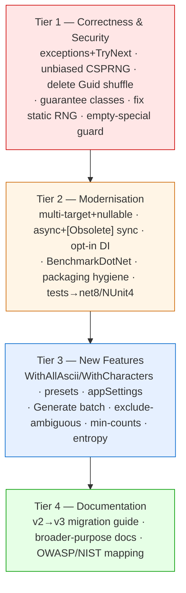
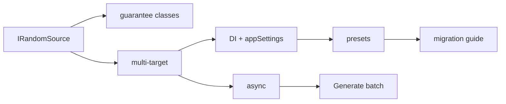
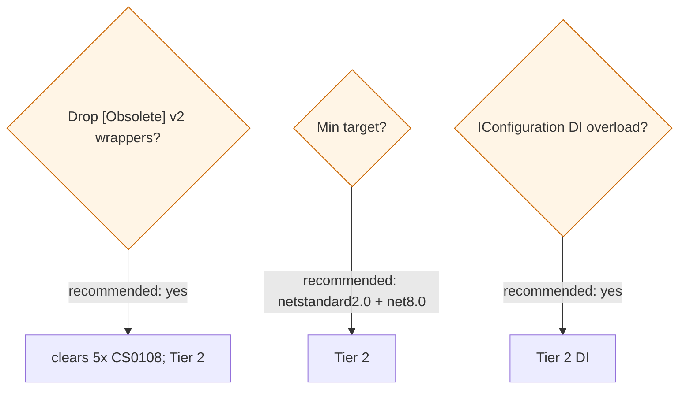

# v3 Target — Roadmap (proposal)

Tiered delivery from the adjusted plan in `../V3_VERIFICATION.md` §3. Sequencing only — not committed
dates.

## Tiers as phases

## Indicative sequencing

```mermaid
gantt
    title v3 indicative sequencing (relative, not dated)
    dateFormat  X
    axisFormat  %s
    section Tier 1 Correctness
    IRandomSource + unbiased selection      :t1a, 0, 3
    Exceptions + TryNext                     :t1b, 0, 2
    Guarantee classes (seed+shuffle)         :t1c, after t1a, 2
    Remove static RNG + dead code            :t1d, after t1a, 1
    section Tier 2 Modernisation
    Multi-target + nullable                  :t2a, after t1c, 2
    Async plus Obsolete sync                 :t2b, after t2a, 2
    Opt-in DI + appSettings bind             :t2c, after t2a, 2
    Tests net8 + NUnit4 + BenchmarkDotNet    :t2d, after t1c, 3
    Packaging hygiene                        :t2e, after t2a, 1
    section Tier 3 Features
    Custom pools + WithAllAscii              :t3a, after t2c, 2
    Presets                                  :t3b, after t3a, 2
    Generate batch + uniqueness              :t3c, after t2b, 2
    Exclude-ambiguous + min-counts + entropy :t3d, after t3a, 3
    section Tier 4 Docs
    Migration guide + standards mapping      :t4a, after t3b, 2
```

## Dependency rationale

`IRandomSource` is the keystone: the correctness fixes, multi-targeting, and testability all build on
it, so it lands first.

## Decision gates (resolve before/within the tier)

See `../V3_VERIFICATION.md` §4 for the reasoning behind each recommendation.

## Release-note discipline

Every v3.x release includes comparative **BenchmarkDotNet** numbers (sync vs async; batch sizes 1 /
100 / 1000 / 10000; allocations) so performance trends are visible across versions.
